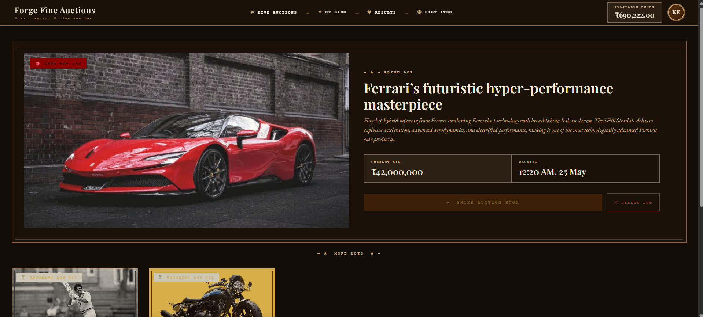
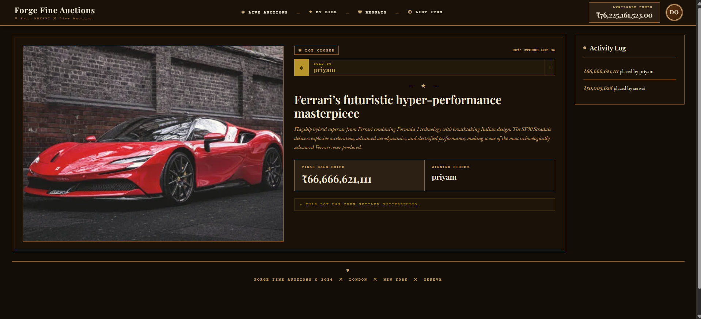
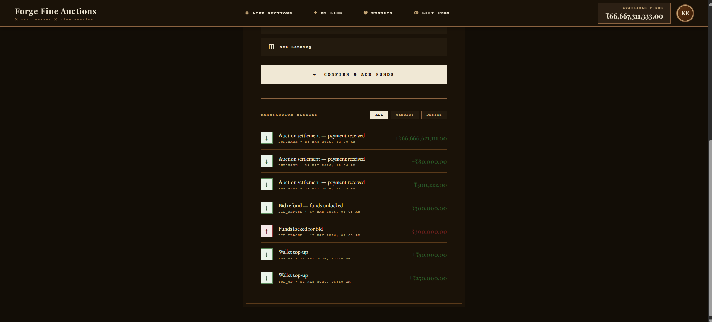

<div align="center">

<pre>
╔══════════════════════════════════════════════════════╗
║                                                      ║
║        F O R G E  —  F I N E  A U C T I O N S       ║
║          Real-Time Bidding  ×  Angular 21            ║
║                                                      ║
╚══════════════════════════════════════════════════════╝
</pre>

[](https://angular.io)
[](https://typescriptlang.org)
[](https://stomp.github.io)
[](LICENSE)

*A vintage-aesthetic, real-time auction frontend! Built to feel like a Christie's catalogue, engineered to move like a trading floor.*

**[Backend →](https://github.com/Ketansinghrajput/FORGE)**

</div>

---

## Overview

`forge-engine-ui` is the Angular frontend for the **FORGE auction platform** — a production-grade, real-time bidding system. While most auction UIs feel transactional and cold, FORGE leans into the theatre of live bidding — parchment tones, serif typography, countdown clocks, and live WebSocket feeds that update without a single page refresh.

This is not a CRUD app with a table. This is a bidding room.







---

## Stack

| Layer | Technology |
|-------|-----------|
| Framework | Angular 21 (Standalone Components) |
| Language | TypeScript 5.x |
| Real-time | WebSocket + STOMP over SockJS |
| Styling | Pure CSS (custom properties, no UI library) |
| HTTP | Angular HttpClient |
| Routing | Angular Router with lazy loading |
| Auth | JWT — stored in localStorage |

---

## Features

```
┌─────────────────────────────────────────────────────┐
│  LIVE AUCTIONS     Real-time bid updates via WS     │
│  COUNTDOWN TIMER   Live end-time clock per auction  │
│  ACTIVITY LOG      Streaming bid history, live      │
│  WALLET            Top-up, balance, tx history      │
│  MY BIDS           Active bids + won/lost status    │
│  LIST ITEM         Create & schedule new auctions   │
│  RESULTS           Completed auction outcomes       │
└─────────────────────────────────────────────────────┘
```

- **Real-time bidding** — WebSocket/STOMP connection to forge-engine; bid placed → all connected clients update instantly
- **Live countdown** — per-auction timer, auto-extends on last-minute bids (anti-sniping)
- **Wallet system** — top-up funds, locked/available balance, paginated transaction history
- **JWT auth** — login/register flow, token-gated routes
- **Parchment aesthetic** — dark warm palette, Playfair Display headings, vintage serif throughout
- **Responsive** — works across desktop and tablet viewports

---

## Project Structure

```
src/app/
├── components/
│   ├── auction-lobby/      # Live auctions grid + featured lot
│   ├── auction-detail/     # Bidding room — WS, timer, activity log
│   ├── create-auction/     # List a new lot
│   ├── wallet/             # Funds management
│   ├── my-bids/            # User's active bids
│   ├── results/            # Completed auctions
│   ├── profile/            # User profile
│   ├── login/              # Auth
│   ├── register/           # Auth
│   └── navbar/             # Global navigation
├── services/
│   ├── wallet.service.ts   # Balance + transaction API
│   └── websocket.service.ts# STOMP connection management
└── guards/                 # Route auth guards
```

---

## Getting Started

**Prerequisites:** Node 18+, Angular CLI 21, FORGE backend running on `:8080`

```bash
# Clone
git clone https://github.com/Ketansinghrajput/forge-engine-ui.git
cd forge-engine-ui

# Install
npm install

# Run (dev server)
ng serve

# Open
# http://localhost:4200
```

**Backend required** — start [FORGE](https://github.com/Ketansinghrajput/FORGE) first (Docker Compose recommended):

```bash
# In the FORGE repo
docker compose up -d
```

---

## WebSocket Architecture

```
Browser (Angular)
    │
    │  SockJS handshake → HTTP upgrade
    ▼
FORGE Backend (Spring Boot)
    │
    ├── /topic/auctions/{id}     ← Broadcast: bid updates, price changes
    ├── /user/queue/errors       ← Private: bid rejection reasons
    └── /app/auction/{id}/bid   → Send: place a bid
```

On `auction-detail` load:
1. JWT fetched from localStorage
2. STOMP connection established with auth header
3. Subscribed to auction topic + personal error queue
4. Bid placed → optimistic UI update → confirmed/rejected via WS

---

## UI Highlights

**Auction Lobby** — featured hero lot + paginated grid. Status-aware cards: `ACTIVE` opens bidding room, `PLANNED` opens detail/preview.

**Bidding Room** — live price tracker, countdown timer with anti-snipe extension indicator, activity log streaming in real-time, available funds validation before bid submit.

**Wallet** — preset amounts + custom input, mock payment flow (UPI/Card/Net Banking), paginated transaction history with CREDIT/DEBIT filter.

---

<div align="center">

*Built by [Ketansingh Rajput](https://github.com/Ketansinghrajput)*

```
× FORGE FINE AUCTIONS × EST. MMXXVI × LIVE AUCTION ×
```

</div>
